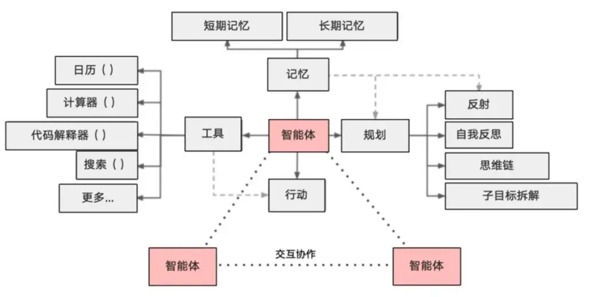
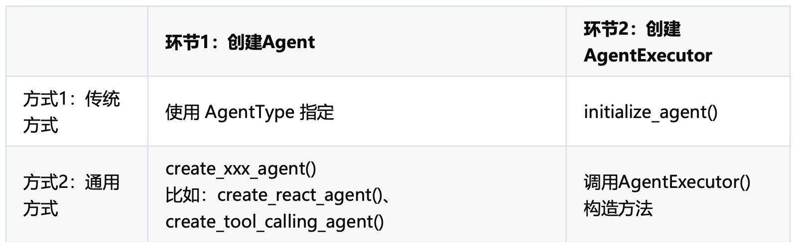

## Agent 与 Chain 的区别
Chain: 硬编码、固定流程的行动序列

Agent:  使用模型作为推理引擎，具备自主决策能力，来确定以什么样的顺序采取什么样的行动，会根据任务动态决定：
* 如何拆解任务
* 需要调用哪些工具
* 以什么顺序调用
* 如何利用好中间结果推进任务

Agent 也可设置固定流程，称为workflow 

## Agent 核心组件

1. LLM ： 作为大脑，提供推理、规划、知识理解能力
    
2. Memory： 具备短期记忆和长期记忆（向量存储）
      
3. Tools：调用外部工具，如：API、数据库

4. Planning（规划）：任务拆解、反思与自省框架实现复杂任务处理

5. Action（行动）：实际执行决策的能力。如：检索、推理、编程

6. 协作： 通过与其它智能体合作，完成更复杂的任务目标

MCP工具：
阿里云百炼 - MCP广场
coze 智能体创建
纳米AI

## Agent 创建

不管是传统方式还是通用方式，每种方式都有： ReAct模式、Function_call 模式。

传统方式相较于通用方式，不用显式提供提示词模版；

通用方式中：

   function_call 模式：创建Agent时，推荐使用ChatPromptTemplate
   ReAct模式： 创建Agent时，推荐使用PromptTemplate

1. Function_call模式：

    * 基于「结构化函数调用」，如：OpenAI Function Calling
    * 直接生成工具调用参数（JSON格式）
    * 效率更高，适合工具明确的场景

    此模式对应的典型AgentType: AgentType.OPENAI_FUNCTIONS 、AgentType.OPENAI_MULTI_FUNCTIONS 

    工作流程：
        直接扫描工具列表，然后调用工具

2. ReAct模式：（Reasoning Acting）

    * 基于文本推理，具备反思和自我纠错能力
      *  推理（reasoning）： 分析当前状态，决定下一步行动
      * 行动（acting）：调用工具并返回结果
      
    * 通过自然语言描述决策过程
    * 适合需要明确推理步骤的场景。如：客服、问答、任务执行

    此模式对应的典型的AgentType:

           AgentType.ZERO_SHOT_REACT_DESCRIPTION :  零样本推理。可以在没有预先训练的情况下尝试解决新的问题

           AgentType.STRUCTURED_CHAT_ZERO_SHOT_REACT_DESCRIPTION：无记忆对话

           AgentType.CONVERSATIONAL_REACT_DESCRIPTION：带记忆对话
   
    工作流程：

        根据用户提问内容，进行思考，在思考过程中调用工具，获取结果
        问题：我要查询xxx
        思考：需要先搜索最新信息 -> 行动：调用搜索工具 -> 观察：获取n个结果值 -> 需要抓取链接 -> 行动：调用scrape_website工具 -> 观察：获取工具结果
        最后：获取结果